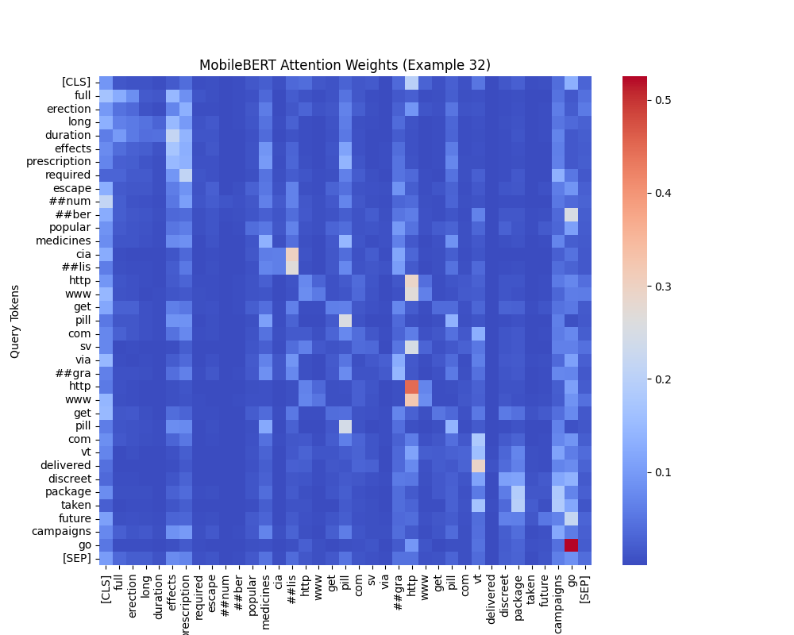
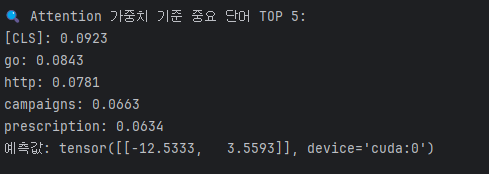
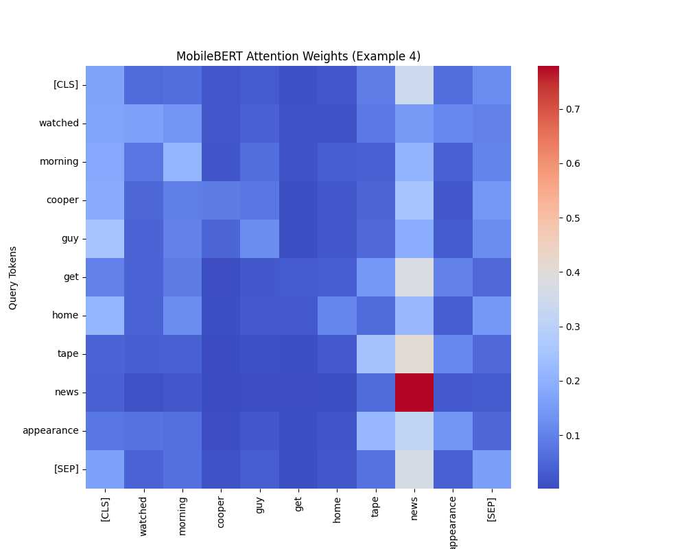
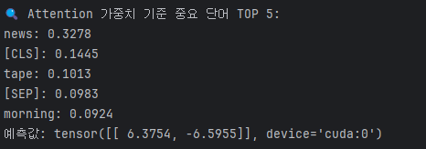

# MobileBERT를 이용한 스팸/정상 이메일 분류 분석

---

## 스팸/정상 이메일 분류 프로젝트를 시작하게 된 이유

스팸 이메일은 거의 모든 이메일 사용자들이 겪는 보편적인 문제입니다. 하루에도 수십, 수백 통의 메일이 도착하지만, 그 중 상당수가 광고나 불필요한 메시지로 가득 차 있습니다. 이로 인해 중요한 메일을 놓칠 위험이 커지고, 시간 낭비와 스트레스도 유발됩니다. 이러한 문제를 해결해보고자, 스팸 메일과 정상 메일을 효과적으로 구별하는 모델을 만들어보려 합니다.

## 프로젝트 목표
이 프로젝트는 **MobileBERT 모델**을 활용하여, 라벨과 이메일 텍스트 데이터를 입력받아 `해당 이메일이 스팸인지 정상인지 정확하게 예측하는 모델을 만드는 것`이 주된 목표입니다.
또한, `정상/스팸 메일이 어떤 단어들로 구성되어 있는지를 분석하여 텍스트의 특징을 시각화하고 이해하는 데에도 집중할 예정` 입니다.

## 실행 환경 구성을 위한 환경 설정
| 순서 | 단계 설명 | 명령어 또는 내용 |
|:----:|-----------|------------------|
| 1 | Git 저장소 클론 (LFS 포함) | `git clone <저장소 URL>` (※ Git LFS가 필요하므로 설치되어 있어야 함) |
| 2 | `setting.yaml` 파일로 Anaconda 환경 구성 준비 | 저장소 내의 `setting.yaml` 파일 확인 |
| 3 | 기존 conda 환경 제거 (선택 사항) | `conda remove --name torch251_gpu --all` |
| 4 | `setting.yaml`을 이용해 새 환경 구성 | `conda env create --file setting.yaml` |
| 5 | PyCharm에서 인터프리터 설정 | PyCharm → Settings → Project → Python Interpreter → 새로 만든 Conda 환경 선택 |
| 6 | 실행 준비 완료 | 모든 환경 구성이 끝나고 실행 가능 |
---

## Dataset 설명 (spam_emails_data.csv)
- **kaggle에 있는 문장 분류를 위한 메일 Ham/Spam Dataset**
- 이메일 문장인 `text` 와 정답인 `label`로 구성되어 있습니다.
- 행은 총 **193,849건**을 가지고 있습니다.
- csv 파일로 저장되어 있기 때문에 `특정 이메일 문장이 너무 길어 엑셀이나 pandas로 열었을때 문자 깨짐` 발생이 발생합니다.

| label | text 예시 (요약) |
|-------|------------------|
| Spam  | `viiiiiiagraaaa...` |
| Ham   | `got ice thought look az original message...` |
| Spam  | `start increasing your odds of success...` |
| Ham   | `attached is the weekly deal report...` |
---

## 전체적인 데이터 전처리 과정
| 단계 | 내용                                                    |
|------|-------------------------------------------------------|
| 1. 필터링 | 데이터를 로드한 후, `label` 값(0=정상, 1=스팸)에 따라 데이터를 분리합니다      |
| 2. 데이터 클리닝 및 정규화 | 텍스트 길이 제한, 언어 필터링, 중복 행 제거. `label` 값은 0과 1로 정규화 시킵니다. |
| 3. 샘플링 | 각 `label` 별 데이터 수를 확인하고, 그에 맞게 알맞은 비율로 데이터를 샘플링 합니다.  |
| 4. 데이터 저장 | 샘플링된 데이터와 비교 데이터를 각각 별도 파일로 저장합니다.                    |

---

### 1~2. 데이터 정제(필터링, 클리닝, 정규화) (data-preprocessing.py)
| 단계 | 설명 |
|:----|:----|
| **CSV 데이터 읽기** | `spam_emails_data.csv` 파일을 읽어 들입니다. |
| **레이블 필터링(정규화)** | 'label' 컬럼 값이 'Ham' 또는 'Spam'인 행만 필터링하여 `0(HAM)-1(SPAM)`으로 정규화 하여 사용합니다. |
| **텍스트 길이 필터링** | 'text' 컬럼의 길이가 1024자 이하인 행만 필터링하여, `너무 긴 텍스트 데이터를 제외`합니다. |
| **언어 필터링** | 텍스트가 영어로 작성된 경우만 필터링하기 위해, `langdetect` 라이브러리를 사용하여 언어가 `영어인 텍스트만` 남깁니다. |
| **중복된 행 제거** | `값이 동일한 중복된 행을 제거하여 데이터를 정리` 합니다. |
| **결과 저장** | 필터링된 데이터를 `spam_emails_data_filtered.csv`라는 새로운 파일로 저장합니다. |

> spam_emails_data_filtered.csv 
**정제 결과**: 총 데이터 **102,101건**, 정상 데이터: **52,168건**, 스팸 데이터: **49,933건**이 추출이 되었습니다.

### 3~4. 데이터 샘플링 후 저장 (data-sample-export.py)
| 단계             | 설명                                                                         |
|:---------------|:---------------------------------------------------------------------------|
| **CSV 데이터 읽기** | 위에 생성했던 `spam_emails_data_filtered.csv` 파일을 읽어 들입니다.                       |
| **데이터 샘플링**    | 위에 데이터를 참고하여 정상데이터:**19,000개**, 스팸데이터:**19,000개*를 랜덤으로 추출하여 샘플링 데이터를 만듭니다. |
| **비교 데이터 저장**  | 비교를 위해 나머지 데이터를 비교 데이터로 저장 합니다. |

> spam_emails_sampled_filter.csv: 
  총 학습 데이터 **38,000건**, 정상 데이터: **19,000건**, 스팸 데이터: **19,000건**

> spam_emails_remaining_filter.csv: 
  총 비교 데이터 **64,101건**, 정상 데이터: **33,168건**, 스팸 데이터: **30,933건**

---

## 토큰화

### 토큰화 과정
- **단어 토큰화**: 각 이메일 텍스트를 단어 단위로 나누어 분석합니다.
- **BERT 토큰화**: MobileBERT 모델을 위한 토큰화 기법을 적용하여, 텍스트를 BERT에서 이해할 수 있는 형식으로 변환합니다.
  - **Tokenizer** 사용
---

## 모델 학습 (MobileBERT-Finetune-GPU.py)

### MobileBERT 모델 설정
- **모델 아키텍처**: MobileBERT는 BERT의 경량화된 버전으로, 빠르고 효율적인 성능을 제공합니다.
- **학습 데이터**: 샘플링된 데이터 `spam_emails_sampled_filter.csv`를 학습 데이터로 사용합니다.
- **학습 클래스의 수**: 2개 - **0(정상), 1(스팸)**

### 학습 파라미터
- **배치 크기**: 8
- **학습률**: 2e-5
- **에포크 수**: 4
  - 한 에포크당 학습 데이터 3,800건, 검증 데이터 950건 
- **최적화 알고리즘**: Adam Optimizer 사용

### 모델 평가

>  
**평가 지표**: 모델의 예측 성능을 확인하고 **accuracy와, loss**를 통해 모델의 전반적인 성능을 평가합니다.  
위에 사진을 봤을때 모델의 훈련은 잘되었다고 판단할 수 있습니다.

### 모델 저장
- 학습된 모델의 가중치를 `mobilebert_custom_model.pt` 폴더에 저장합니다.

---
## 결과 분석 및 모델 개선 

### 모델이 정상/스팸을 분류할때 어떠한 단어에 집중하는지 (MobileBERT-Attention-weights.py)

## 스팸 데이터 분석

> 32번 문장데이터를 보았을떄 모델에서 **go, http, prescription, campaigns** 라는 단어에 집중 하는 모습을 볼 수 있습니다.  
  
최종적으로 FCN(최종층)에서 값을 계산한 결과 **1번 클래스의 값이 높으므로 스팸으로 분류됩니다.**

## 정상 데이터 분석

> 4번 문장데이터를 보았을떄 모델에서 **news, tape, morning** 라는 단어에 집중 하는 모습을 볼 수 있습니다.  
  
최종적으로 FCN(최종층)에서 값을 계산한 결과 **0번 클래스의 값이 높으므로 정상으로 분류됩니다.**

---

### 모델 테스트 결과 (MobileBERT-inference.py)
>  
비교 데이터 64,101건에 대해서 **98% 정확도**를 보이고 있습니다.

### 모델 개선 방법
- **하이퍼파라미터 튜닝**: 학습률, 배치 크기 등 모델의 하이퍼 파라미터를 조정하여 성능을 최적화 합니다.
- **데이터 증강**: dataset 에서 정상 및 스팸 관련 데이터를 증강 합니다.

---
## 결론

이 프로젝트는 MobileBERT 모델을 사용하여 스팸 이메일을 정확하게 분류하는 모델을 구축하는 것과 모델이 어떠한 단어에 집중하는지 분석하는것을 목표로 했습니다. 데이터 전처리부터 모델 학습, 평가, 개선까지 전반적인 과정이 포함되었으며, 최종적으로 98%의 정확도를 가진 스팸 분류 모델을 완성할 수 있었습니다.

---
### reference
- https://www.kaggle.com/datasets/meruvulikith/190k-spam-ham-email-dataset-for-classification (MIT Lisence)
- https://github.com/hschu/finetuning_mobilebert
