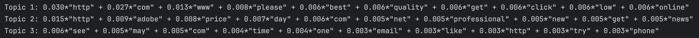
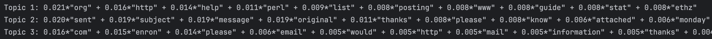
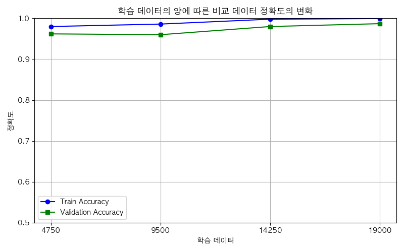
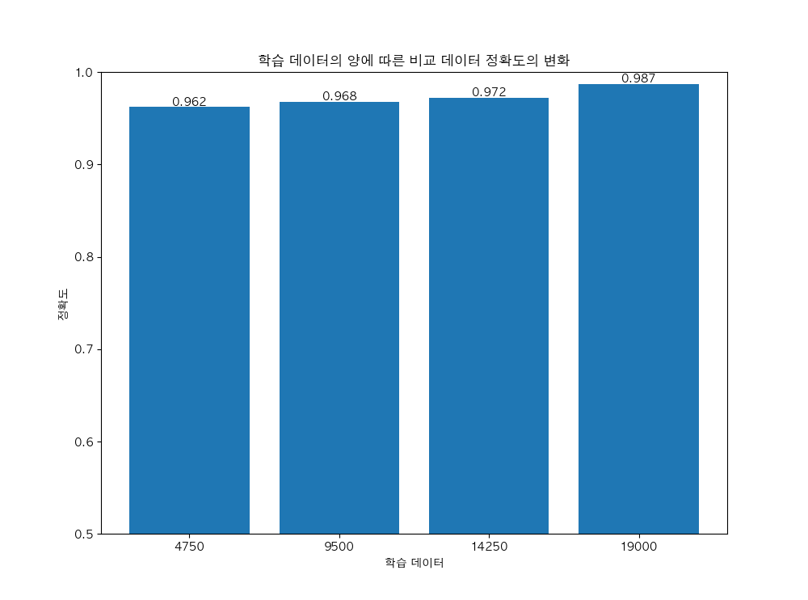

# MobileBERT를 이용한 스팸/정상 이메일 분류 분석

---

### 문제 인식
오늘날 거의 모든 이메일 사용자들은 매일 수십, 수백 통의 메일을 수신합니다. 이러한 이메일 중에는 중요한 업무 연락, 금융 정보, 개인적인 소식 등 꼭 확인해야 할 메시지들이 포함되어 있습니다. 하지만 이 중 상당수가 광고, 피싱, 스팸 등 원치 않는 메시지로 구성되어 있으며, 이러한 불필요한 이메일은 사용자의 집중력을 분산시키고, 실제로 필요한 정보를 놓칠 위험을 증가시킵니다. 특히 스마트폰이나 태블릿과 같은 모바일 기기를 통해 이메일을 확인하는 비율이 높아짐에 따라, 스팸/피싱 메일로 인한 보안 위협 및 사용자 피해 사례는 더욱더 빈번해지고 있습니다.

### 문제의 심각성
스팸 이메일은 단순한 불편함을 넘어서 다양한 문제를 야기합니다. 예를 들어, 피싱 이메일은 수신자의 개인정보를 탈취하거나 금융사기를 유도하여 심각한 보안 위협을 초래할 수 있습니다. 또한 기업에서는 업무용 메일함에 스팸이 지속적으로 유입될 경우, 중요한 업무 지시나 고객 응답을 놓치게 되어 생산성 저하로 이어질 수 있습니다. 이 외에도, 스팸 메일을 계속해서 수신하게 될 경우 사용자는 이메일 확인 자체에 스트레스를 느끼며, 디지털 피로감(Digital Fatigue)을 호소하기도 합니다. 이로 인해 스팸 필터링은 단순한 편의 기능을 넘어, 개인과 조직의 정보 보호 및 효율적인 커뮤니케이션을 위한 핵심 요소로 자리 잡고 있습니다.

### 2025년 스팸 메일 동향

2025년 기준, 스팸 메일은 다양한 유형으로 나타나며, 그 비율은 다음과 같습니다.

| 스팸 유형             | 비율    | 설명                                                                 |
|----------------------|---------|----------------------------------------------------------------------|
| 피싱 (Phishing)       | 48%     | 로그인 페이지를 모방하여 사용자 정보를 탈취하는 시도                              |
| 가짜 페이지 메일       | 50%     | 유명 사이트를 위장한 첨부파일 형태의 피싱 메일                                     |
| 배송/물류 관련 메일     | 20.6%   | 배송, 운송, 세관 등을 사칭하여 사용자의 클릭을 유도하는 메일                           |
| 공지/알림성 키워드 메일 | 8.7%    | "긴급", "안내" 등의 키워드로 불안감을 자극하여 클릭을 유도하는 메일                      |

### 스팸 메일 분류 체계

이러한 다양한 스팸 메일은 세부적으로 다음과 같이 분류할 수 있습니다.

| 분류 | 설명 |
|:-----|:-----|
| 사적 | 개인적으로 또는 업무용으로 주고받은 메일 |
| 사적(초대) | SNS에서 개인 계정으로 보내는 광고·알림 메시지 (초대 등) |
| 정상 광고 메일(수신 동의) | 수신자가 수신을 동의한 광고메일 |
| 정상 광고 메일(기존 거래 관계) | 최근 6개월 이내에 재화를 구매하거나 서비스를 이용한 기존 거래 관계에 기반한 광고메일 |
| 스팸(도박) | 국내외 도박사이트 또는 오프라인 도박 장소를 광고하는 메일 |
| 스팸(불법대출) | 불법 대출 상품 광고 (신용대출, 주택담보대출, 정부지원 사칭 등) |
| 스팸(의약품) | 불법 의약품(비아그라, 시알리스 등) 광고 (건강보조식품 제외) |
| 스팸(주식) | 리딩방, 증권사, 투자 컨설팅사 등에서 발송한 주식 관련 정보 광고 |
| 스팸(카드/보험/은행 등) | 신용카드사, 은행, 보험사에서 보낸 상품 및 서비스 광고 (대출상품 제외) |
| 스팸(재테크/투자) | 코인, 금융 등 재테크 투자 관련 광고 |
| 스팸(성인) | 성인 관련 음란 표현, 유흥주점, 성매매 알선 광고 |
| 스팸(교육/유학) | 자격증 취득, 학위취득, 교재 판매, 유학 관련 광고 |
| 스팸(건강정보) | 건강정보, 건강보조식품 관련 광고 (불법 의약품 제외) |
| 스팸(취업/창업) | 취업, 창업 관련 안내, 홍보, 권유 메일 |
| 스팸(통신가입) | 인터넷 서비스, 휴대전화 가입, 번호 이동 권유 광고 |
| 스팸(기타) | 기존 분류에 포함되지 않지만 수신자를 기만하거나 사회적 물의를 일으키는 메일 |

### 문제 해결 접근

이처럼 다양한 유형의 스팸 메일이 증가함에 따라, 이를 효과적으로 식별하고 자동으로 분류하는 시스템의 필요성이 더욱 커지고 있습니다. 특히, 사람의 수작업 분류가 어려운 상황에서는 인공지능 기반의 자동 분류 모델이 큰 도움이 될 수 있습니다.

---

## 프로젝트 목표

본 프로젝트는 **MobileBERT 모델**을 활용하여 이메일 텍스트와 라벨 데이터를 기반으로  
- 스팸 메일과 정상 메일을 효과적으로 분류하고,  
- 정상/스팸 메일이 갖는 특징적인 단어들을 시각화하여 의미 있는 패턴을 분석하는 것을 목표로 합니다.

## 실행 환경 구성을 위한 환경 설정
| 순서 | 단계 설명 | 명령어 또는 내용 |
|:----:|-----------|------------------|
| 1 | Git 저장소 클론 (LFS 포함) | `git clone <저장소 URL>` (※ Git LFS가 필요하므로 설치되어 있어야 함) |
| 2 | `setting.yaml` 파일로 Anaconda 환경 구성 준비 | 저장소 내의 `setting.yaml` 파일 확인 |
| 3 | 기존 conda 환경 제거 (선택 사항) | `conda remove --name torch251_gpu --all` |
| 4 | `setting.yaml`을 이용해 새 환경 구성 | `conda env create --file setting.yaml` |
| 5 | PyCharm에서 인터프리터 설정 | PyCharm → Settings → Project → Python Interpreter → 새로 만든 Conda 환경 선택 |
| 6 | 실행 준비 완료 | 모든 환경 구성이 끝나고 실행 가능 |
---

## Dataset 설명 (spam_emails_data.csv)
- **kaggle에 있는 문장 분류를 위한 메일 Ham/Spam Dataset**
- 이메일 문장인 `text` 와 정답인 `label`로 구성되어 있습니다.
- 행은 총 **193,849건**을 가지고 있습니다.
- csv 파일로 저장되어 있기 때문에 `특정 이메일 문장이 너무 길어 엑셀이나 pandas로 열었을때 문자 깨짐` 발생이 발생합니다.

| label | text 예시 (요약) |
|-------|------------------|
| Spam  | `viiiiiiagraaaa...` |
| Ham   | `got ice thought look az original message...` |
| Spam  | `start increasing your odds of success...` |
| Ham   | `attached is the weekly deal report...` |
---

## 전체적인 데이터 전처리 과정
| 단계 | 내용                                                    |
|------|-------------------------------------------------------|
| 1. 필터링 | 데이터를 로드한 후, `label` 값(0=정상, 1=스팸)에 따라 데이터를 분리합니다      |
| 2. 데이터 클리닝 및 정규화 | 텍스트 길이 제한, 언어 필터링, 중복 행 제거. `label` 값은 0과 1로 정규화 시킵니다. |
| 3. 샘플링 | 각 `label` 별 데이터 수를 확인하고, 그에 맞게 알맞은 비율로 데이터를 샘플링 합니다.  |
| 4. 데이터 저장 | 샘플링된 데이터와 비교 데이터를 각각 별도 파일로 저장합니다.                    |

---

### 1~2. 데이터 정제(필터링, 클리닝, 정규화) (data-preprocessing.py)
| 단계 | 설명                                                                       |
|:----|:-------------------------------------------------------------------------|
| **CSV 데이터 읽기** | `spam_emails_data.csv` 파일을 읽어 들입니다.                                      |
| **레이블 필터링(정규화)** | 'label' 컬럼 값이 'Ham' 또는 'Spam'인 행만 추출한 후, `0(HAM)-1(SPAM)`으로 정규화 합니다.     |
| **텍스트 길이 필터링** | 'text' 컬럼의 길이가 1024자 이하인 행만 필터링하여, `너무 긴 텍스트 데이터를 제외`합니다.                |
| **언어 필터링** | 텍스트가 영어로 작성된 경우만 필터링하기 위해, `langdetect` 라이브러리를 사용하여 언어가 `영어인 텍스트만` 남깁니다. |
| **중복된 행 제거** | `값이 동일한 중복된 행을 제거하여 데이터를 정리` 합니다.                                        |
| **결과 저장** | 필터링된 데이터를 `spam_emails_data_filtered.csv`라는 새로운 파일로 저장합니다.               |

> spam_emails_data_filtered.csv 
**정제 결과**: 총 데이터 **102,101건**, 정상 데이터: **52,168건**, 스팸 데이터: **49,933건**이 추출이 되었습니다.

### 3~4. 데이터 샘플링 후 저장 (data-sample-export.py)
| 단계             | 설명                                                                          |
|:---------------|:----------------------------------------------------------------------------|
| **CSV 데이터 읽기** | 위에 생성했던 `spam_emails_data_filtered.csv` 파일을 읽어 들입니다.                        |
| **데이터 샘플링**    | 위에 데이터를 참고하여 정상데이터:**19,000개**, 스팸데이터:**19,000개**를 랜덤으로 추출하여 샘플링 데이터를 만듭니다. |
| **비교 데이터 저장**  | 비교를 위해 나머지 데이터를 비교 데이터로 저장 합니다.                                             |

> spam_emails_sampled_filter.csv: 
  총 학습 데이터 **38,000건**, 정상 데이터: **19,000건**, 스팸 데이터: **19,000건**

> spam_emails_remaining_filter.csv: 
  총 비교 데이터 **64,101건**, 정상 데이터: **33,168건**, 스팸 데이터: **30,933건**

---

## 데이터 시각화(data-topicModeling.py)

### 전체적인 데이터 시각화 과정

| 순서 | 단계 설명 | 주요 내용 및 사용 라이브러리 |
|:----:|:---------|:----------------------------|
| 1 | 라이브러리 불러오기 및 NLTK 다운로드 | `pandas`, `nltk`, `gensim`, `pyLDAvis` |
| 2 | 데이터 불러오기 | `pd.read_csv("spam_emails_data_filtered.csv")` |
| 3 | 사용자 정의 불용어 추가 설정 | `escapenumber`, `escapelong` + NLTK 기본 영어 불용어 제거 |
| 4 | 전처리 함수 정의 | 소문자 변환, 특수문자 제거, 토큰화, 불용어 및 2글자 이하 단어 제거 |
| 5 | 전처리 적용 | `data['clean_text'] = data['text'].apply(preprocess)` |
| 6 | 라벨별 데이터 분리 | 스팸(`label=1`)과 정상(`label=0`) 데이터 분리 |
| 7 | LDA 모델 학습 함수 정의 | `Gensim`의 `LdaModel`을 이용해 토픽 모델링 수행 |
| 8 | LDA 모델 학습 및 토픽 출력 | 각각 3개 토픽 추출 (`spam`, `normal` 각각) |
| 9 | LDA 결과 시각화 및 저장 | `pyLDAvis`를 이용해 HTML 파일(`spam_topics.html`, `normal_topics.html`)로 저장 |

### 스팸 메일로 분류된 데이터 분석 (spam_topics.html)
> 

| 토픽 번호 | 주요 키워드                                                                                | 해석 |
|-----------|---------------------------------------------------------------------------------------|------|
| **Topic 1** | `http`, `com`, `www`, `please`, `best`, `quality`, `743get`, `click`, `low`, `online` | 온라인 쇼핑/광고 관련. 저품질 제품, 클릭 유도형 마케팅 링크 포함. |
| **Topic 2** | `http`, `adobe`, `price`, `day`, `net`, `professional`, `new`, `get`, `news`          | 소프트웨어 할인/광고. Adobe 등 유명 소프트웨어 이름을 사칭한 스팸일 가능성 있음. |
| **Topic 3** | `see`, `may`, `com`, `time`, `one`, `email`, `like`, `try`, `phone`                   | 일반적인 스팸 대화 표현. 사용자 유도 문구 (`try`, `see`, `like`) 포함됨. |

### 정상 메일로 분류된 데이터 분석 (normal_topics.html)
> 

토픽 번호 | 주요 키워드 | 해석 |
|-----------|-------------|------|
| **Topic 1** | `org`, `http`, `help`, `perl`, `list`, `posting`, `guide`, `stat`, `ethz` | 기술 문서/개발 관련 메일. 개발자 커뮤니티 또는 기술 안내 내용. |
| **Topic 2** | `sent`, `subject`, `message`, `original`, `thanks`, `please`, `know`, `attached`, `monday`, `november` | 일반적인 업무용 커뮤니케이션. 회신, 감사 인사, 날짜 언급 중심. |
| **Topic 3** | `com`, `enron`, `please`, `email`, `would`, `http`, `mail`, `information`, `thanks`, `new` | 회사 내부 이메일. 기업 커뮤니케이션 흐름을 나타냄. |

### 데이터 분석 결론

| 분류 | 주제 경향 | 특징 |
|------|-----------|------|
| **스팸 메일** | 광고, 유도, 브랜드 사칭 키워드 다수 | 클릭 유도, 피싱, 판촉 메시지 중심 |
| **정상 메일** | 업무, 기술 문서, 감사 표현 등 | 조직 내 커뮤니케이션 또는 개발/기술 관련 |
---

## 토큰화

### 토큰화 과정
- **단어 토큰화**: 각 이메일 텍스트를 단어 단위로 나누어 분석합니다.
- **BERT 토큰화**: MobileBERT 모델을 위한 토큰화 기법을 적용하여, 텍스트를 BERT에서 이해할 수 있는 형식으로 변환합니다.
  - **Tokenizer** 사용
---

## 모델 학습 (MobileBERT-Finetune-GPU.py)

### MobileBERT 모델 설정
- **모델 아키텍처**: MobileBERT는 BERT의 경량화된 버전으로, 빠르고 효율적인 성능을 제공합니다.
- **학습 데이터**: 샘플링된 데이터 `spam_emails_sampled_filter.csv`를 학습 데이터로 사용합니다.
- **학습 클래스의 수**: 2개 - **0(정상), 1(스팸)**

### 학습 파라미터
- **배치 크기**: 8
- **학습률**: 2e-5
- **에포크 수**: 4
  - 한 에포크당 학습 데이터 3,800건, 검증 데이터 950건 
- **최적화 알고리즘**: Adam Optimizer 사용

### 학습 데이터의 수에 따른 모델 평가

>  
**평가 지표**: 모델의 예측 성능을 확인하고 **accuracy와, loss**를 통해 모델의 전반적인 성능을 평가합니다.  
위에 사진을 봤을때 학습 데이터가 4,750건일때 정확도는 96%를 달성 했습니다.  
학습 데이터 수가 많으면 많을수록 모델 학습/검증 값은 상승하지만 비약적으로 크게 상승하지는 않습니다.

### 모델 저장
- 학습된 모델의 가중치를 `mobilebert_custom_model.pt` 폴더에 저장합니다.
---

### 모델 테스트 결과 (MobileBERT-inference.py)
>  
비교 데이터 64,101건에 대해서 학습 데이터의 수에 따라 정확도를 비교 해보았더니 정확도가 96% ~ 98% 사이로 보이고 있습니다.

### 모델 개선 방법
- **하이퍼파라미터 튜닝**: 학습률, 배치 크기 등 모델의 하이퍼 파라미터를 조정하여 성능을 최적화 합니다.
- **데이터 증강**: dataset 에서 정상 및 스팸 관련 데이터를 증강 합니다.

---
## 결론

이 프로젝트는 MobileBERT 모델을 사용하여 스팸 이메일을 정확하게 분류하는 모델을 구축하는 것과 스팸/정상 메일이 갖는 특징적인 단어와 문장을 시각화하여 의미 있는 패턴을 분석하는 것에 집중했습니다.

특히 LDA 기반의 토픽 모델링을 활용하여, 스팸 메일에서는 ‘광고’, ‘이벤트’, ‘금융 혜택’과 관련된 주제가 주로 등장하고, 정상 메일에서는 ‘업무’, ‘회신 요청’, ‘공지사항’ 등과 같은 주제가 나타나는 것을 확인할 수 있었습니다. 이를 통해 단순한 분류를 넘어서, 이메일 내용에 기반한 주제 구조의 차이를 이해하고 실질적인 필터링 기준으로 활용 가능한 인사이트를 도출하였습니다.

또한 모델 훈련에서는 전체 19,000건의 샘플 데이터를 약 4,750건씩 나누어 학습을 진행했음에도 불구하고, 각 분할 학습에서 96~98%에 달하는 높은 정확도를 보였습니다. 이는 비교적 적은 양의 학습 데이터로도 모델이 유의미한 특징을 효과적으로 학습하고 있음을 의미합니다.

이러한 결과는 MobileBERT와 같은 경량화된 사전학습 언어 모델이 실제 응용 환경에서도 충분한 성능을 발휘할 수 있음을 보여주며, 동시에 토픽 모델링을 통한 텍스트 구조 분석이 분류 모델의 보조 수단으로써 어떻게 유의미한 해석력을 제공할 수 있는지를 시사합니다.

---
### reference
- https://www.kaggle.com/datasets/meruvulikith/190k-spam-ham-email-dataset-for-classification (MIT Lisence)
- https://github.com/hschu/finetuning_mobilebert
- https://asec.ahnlab.com/ko/86326/ (스팸 메일 동향)
